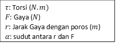
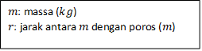
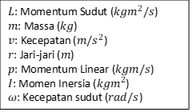

# Dinamika Rotasi

## Torsi (Momen Gaya)

$$
{\tau = F.r.sin(\alpha)}
$$



### Torsi untuk n-buah Gaya

$${\tau = \sum_{i=1}^n {\tau_i}}$$

Aturan:

- Torsi bernilai (+) jika searah Jarum Jam
- Torsi bernilai (-) jika berlawanan arah Jarum Jam

## Momen Inersia

$${I=m.r^2}$$



### Momen Inersia untuk n-buah massa

$$
{I=\sum_{i=1}^n{m_{i} r_{i}}}
$$

### Momen Inersia untuk Benda Kontinu

$${I=\int{r^2 dm}}$$

### Momen Inersia untuk benda kontinu bentuk tertentu

| Benda                                     | Momen Inersia            |
| ----------------------------------------- | ------------------------ |
| Batang homogen diputar di **Pusat**       | $${I={1\over 12} mL^2}$$ |
| Batang homogen diputar di **Tepi**        | $${I={1\over 3} mL^2}$$  |
| Silinder Pejal Poros melalui **Pusat**    | $${I={1\over 2} mr^2}$$  |
| Silinder Berongga Poros melalui **Pusat** | $${I=mr^2}$$             |
| Bola Pejal Poros melalui **Pusat**        | $${I={2\over 5} mr^2}$$  |
| Bola Berongga Poros melalui **Pusat**     | $${I={2\over 3} mr^2}$$  |

## Momentum Sudut

$${L=mvr = \vec{p} \times \vec{r}=I \omega}$$



<!-- | Besaran | Nama | Satuan |
| ----------- | ----------- | ----------- |
| $${m}$$ | Massa | $${kg}$$ |
| $${v}$$ | Kecepatan linear | $${m/s^2}$$ | -->

### Hukum Kekekalan Momentum Sudut

$${L_{awal}=L_{akhir}}$$
$${I_1 \omega_{1}=I_2 \omega_{2}}$$

## Energi pada Gerak Menggelinding

### Energi Kinetik pada Gerak Menggelinding

pada gerak menggelinding, ada 2 jenis gerakan:

- Gerak Translasi (lurus): $${E_{k_{trans}}={1 \over 2}mv^2}$$
- Gerak Rotasi (melingkar): $${E_{k_{rot}}={1 \over 2}I \omega^2}$$

### Energi Kinetik Total pada Gerak Menggelinding

$${E_{k_{tot}}=E_{k_{trans}}+E_{k_{rot}}={1 \over 2}mv^2 + {1 \over 2}I \omega^2}$$

### Energi Mekanik pada Gerak Menggelinding

$${E_{m_{1}}=E_{m_{2}}}$$

$${E_{p_{1}}+E_{k_{trans_{1}}}+E_{k_{rot_{1}}} = E_{p_{2}}+E_{k_{trans_{2}}}+E_{k_{rot_{2}}}}$$

```
@mohyusufz
Thank's
```
